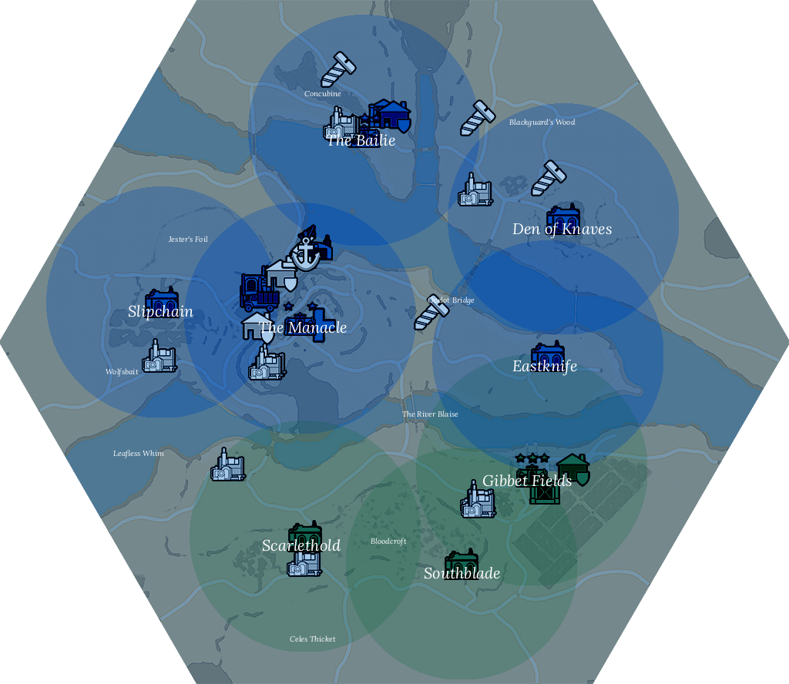

# Region Sentry Bot

This bot is based on the FOXHOLE warapi.

Original repository - https://github.com/clapfoot/warapi

Original license - https://github.com/clapfoot/warapi?tab=License-1-ov-file

## Table of Contents

- [Installation](#installation)
- [Usage](#usage)
- [License](#license)

## Installation

Install the required dependencies
```bash
pip install -r requirements.txt
```

Create a new .env file containing your discord bot's token
```bash
DISCORD_BOT_TOKEN="your token goes here"
```

## Usage

Add the bot to your discord server. Now you can use the region commands
```bash
/region :name:
```
```bash
/map
```
```bash
/zones
```
```bash
/set_shard
```

An example of /map image output


Examples of /region image output



Examples of /zones image output


## License

You must follow all of the original license instructions from warapi https://github.com/clapfoot/warapi?tab=License-1-ov-file

I do not own any of the images provided in this repository, all of them were taken from the original warapi repository https://github.com/clapfoot/warapi

Foxhole is a registered trademark of Siege Camp. This repository is not affiliated with Siege Camp
